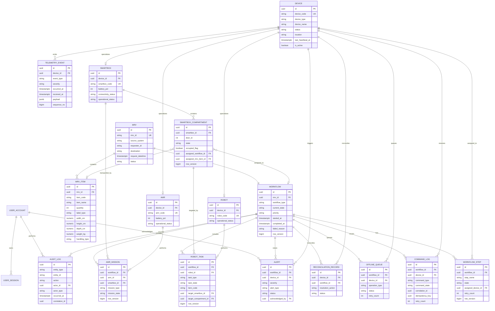

# C2 Database ERD

Project: C2 Central Management System  
Database target: PostgreSQL  
Source specs: `/specs/08-data-model.md`, `/specs/04-domain-rules.md`, `/specs/07-api-integration.md`

## Design Notes

- C2 owns workflow state, command history, audit history, and recovery state.
- AB3/UM owns MRV source data.
- SAP/stock control owns inventory validation.
- Devices own physical state.
- Audit logs are immutable and append-only.
- Key workflow entities use `row_version` for optimistic concurrency.
- Command APIs rely on `idempotency_key` and correlation IDs for retry safety.

## Mermaid ERD

