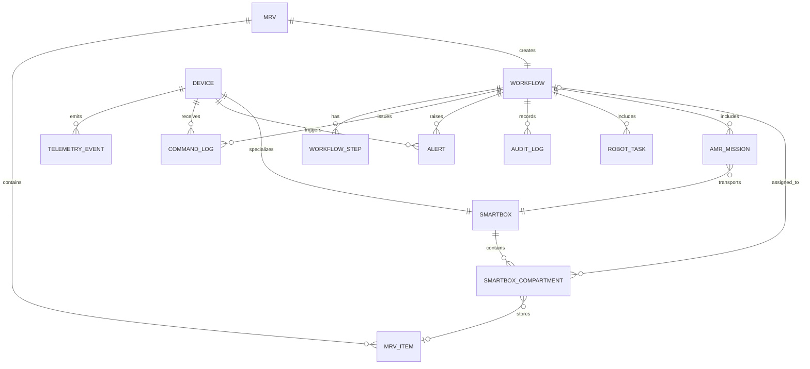

# DATA ARCHITECTURE — C2 CENTRAL MANAGEMENT SYSTEM

# CORE ENTITIES

## 1. MRV

Represents material request from AB3/UM.

Key fields:

* mrvId
* sourceSystem
* requesterId
* destination
* requestDateTime
* status

---

## 2. MRV Item

Represents item requested under MRV.

Key fields:

* mrvItemId
* mrvId
* itemCode
* itemName
* quantity
* labelType
* size
* weight
* handlingType

---

## 3. Workflow

Represents end-to-end orchestration lifecycle.

Key fields:

* workflowId
* mrvId
* workflowType
* currentState
* priority
* startedAt
* completedAt
* failedReason

---

## 4. Workflow Step

Represents each workflow task/state.

Key fields:

* workflowStepId
* workflowId
* stepName
* state
* assignedDeviceId
* startedAt
* completedAt
* retryCount

---

## 5. Device

Generic device registry.

Device types:

* Kardex
* Mobile Manipulator
* SMARTBox
* AMR

Key fields:

* deviceId
* deviceType
* deviceName
* status
* location
* lastHeartbeatAt
* isActive

---

## 6. SMARTBox

Represents SMARTBox unit.

Key fields:

* smartBoxId
* deviceId
* batteryPct
* connectivityStatus
* currentLocation
* operationalStatus

---

## 7. SMARTBox Compartment

Represents each compartment/door.

Key fields:

* compartmentId
* smartBoxId
* doorId
* state
* occupiedFlag
* assignedWorkflowId
* assignedMrvItemId

---

## 8. AMR Mission

Represents pickup/delivery/return mission.

Key fields:

* missionId
* workflowId
* amrId
* smartBoxId
* missionType
* missionState
* pickupLocation
* dropoffLocation
* startedAt
* completedAt

---

## 9. Robot Task

Represents Mobile Manipulator task.

Key fields:

* robotTaskId
* workflowId
* robotId
* taskType
* taskState
* itemCode
* targetSmartBoxId
* targetCompartmentId

---

## 10. Telemetry Event

Stores device status/events.

Key fields:

* telemetryEventId
* deviceId
* eventType
* payload
* severity
* occurredAt

---

## 11. Command Log

Stores commands sent to devices.

Key fields:

* commandId
* workflowId
* deviceId
* commandType
* requestPayload
* responsePayload
* commandState
* correlationId
* idempotencyKey

---

## 12. Alert

Represents operational alert.

Key fields:

* alertId
* workflowId
* deviceId
* severity
* alertType
* message
* status
* acknowledgedBy
* acknowledgedAt

---

## 13. User

Represents platform user.

Key fields:

* userId
* username
* role
* department
* status

---

## 14. Audit Log

Immutable audit record.

Key fields:

* auditId
* entityType
* entityId
* action
* previousValue
* newValue
* actorId
* actorType
* occurredAt
* correlationId

---

# RELATIONSHIPS

## MRV Relationships

* MRV has many MRV Items
* MRV has one Workflow
* MRV belongs to source system AB3/UM

---

## Workflow Relationships

* Workflow belongs to MRV
* Workflow has many Workflow Steps
* Workflow has many Command Logs
* Workflow has many Alerts
* Workflow has many Audit Logs

---

## Device Relationships

* Device has many Telemetry Events
* Device has many Command Logs
* Device may be linked to Workflow Step
* Device may raise Alerts

---

## SMARTBox Relationships

* SMARTBox extends Device
* SMARTBox has many Compartments
* Compartment may be assigned to one Workflow
* Compartment may contain one MRV Item

---

## AMR Relationships

* AMR extends Device
* AMR has many Missions
* Mission belongs to Workflow
* Mission may transport one SMARTBox

---

## Robot Relationships

* Robot extends Device
* Robot has many Robot Tasks
* Robot Task belongs to Workflow
* Robot Task targets SMARTBox Compartment

---

# SUGGESTED ERD



---

# AUDIT FIELDS

Apply to all transactional tables.

## Standard Fields

* createdAt
* createdBy
* updatedAt
* updatedBy
* deletedAt
* deletedBy
* isDeleted

---

## Traceability Fields

* correlationId
* traceId
* requestId
* workflowId
* sourceSystem
* sourceReferenceId

---

## Operational Fields

* status
* previousStatus
* statusChangedAt
* statusChangedBy
* failureReason
* retryCount

---

## Device Event Fields

* deviceId
* deviceType
* eventType
* severity
* occurredAt
* receivedAt
* rawPayload

---

# CONCURRENCY RULES

## CR-001 — Workflow State Lock

Only one active state transition is allowed per workflow at a time.

---

## CR-002 — Optimistic Concurrency

Use version field for key entities:

* Workflow
* Workflow Step
* SMARTBox Compartment
* AMR Mission
* Robot Task

Field:

```text
rowVersion / version
```

---

## CR-003 — Compartment Assignment Lock

A compartment cannot be assigned to multiple active workflows.

Rule:

```text
smartBoxId + compartmentId + activeAssignment must be unique
```

---

## CR-004 — Duplicate MRV Protection

Only one active workflow allowed per MRV ID.

Rule:

```text
mrvId + sourceSystem + activeWorkflow must be unique
```

---

## CR-005 — Command Idempotency

Each command must use idempotency key.

Rule:

```text
deviceId + idempotencyKey = unique
```

---

## CR-006 — Event Deduplication

Telemetry events must be deduplicated using:

* deviceId
* eventType
* timestamp
* sequenceNo, if available

---

## CR-007 — State Transition Validation

State transition allowed only if current state is valid.

Example:

```text
DELIVERED → COLLECTION_PENDING = valid
COMPLETED → DELIVERY_IN_PROGRESS = invalid
```

---

## CR-008 — Device Command Safety

Do not issue conflicting commands concurrently.

Examples:

* open and close same door
* assign same AMR to two missions
* assign same robot to two active tasks

---

# OFFLINE SYNC DATA

## Required Offline Snapshot

Store last known state for:

* workflows
* devices
* SMARTBoxes
* compartments
* AMR missions
* robot tasks
* alerts

---

## Offline Queue Data

For pending safe operations:

* offlineQueueId
* operationType
* entityType
* entityId
* payload
* retryCount
* queuedAt
* lastAttemptAt
* status

---

## Reconciliation Data

Store reconciliation records:

* reconciliationId
* deviceId
* workflowId
* c2State
* deviceState
* resolutionAction
* resolvedBy
* resolvedAt

---

## Sync Rules

* C2 remains source of workflow truth.
* Device remains source of physical truth.
* On reconnect, query device state first.
* Reconcile before replaying queued commands.
* Unsafe commands must not auto-replay.
* All sync conflicts must be audited.

---

## Offline Data States

```text
ONLINE
OFFLINE
SYNC_PENDING
RECONCILIATION_REQUIRED
SYNCED
SYNC_FAILED
```

---

# DATA RETENTION RULES

## Operational Data

Recommended retention:

* active workflow data: until completed
* completed workflow data: 3–7 years
* failed workflow data: 3–7 years

---

## Audit Logs

Recommended retention:

* minimum 7 years
* immutable
* searchable
* exportable

---

## Telemetry Data

Recommended retention:

* raw telemetry: 30–90 days
* critical events: 3–7 years
* aggregated metrics: 1–3 years

---

## Command Logs

Recommended retention:

* all device commands: 3–7 years
* failed commands: 7 years
* retry records: 7 years

---

## Alert Data

Recommended retention:

* resolved alerts: 1–3 years
* critical alerts: 3–7 years

---

## Security Logs

Recommended retention:

* login events: 1–3 years
* access violations: 3–7 years
* admin actions: 7 years

---

## Data Archival

Archived data should be:

* compressed
* read-only
* searchable by workflow ID/MRV ID
* exportable for audit

---

# DATA GOVERNANCE RULES

## DGR-001 — Source of Truth

* C2 owns workflow data.
* AB3/UM owns MRV source data.
* SAP owns inventory validation.
* Devices own physical state.

---

## DGR-002 — Immutable Audit

Audit logs must not be updated or deleted.

---

## DGR-003 — Payload Storage

Store raw request/response payloads for:

* vendor integration troubleshooting
* audit traceability
* replay/reconciliation

---

## DGR-004 — PII Minimization

Store only necessary user data:

* user ID
* role
* department
* action history

---

## DGR-005 — Data Quality

Mandatory data validations:

* valid workflow ID
* valid device ID
* valid timestamp
* valid state transition
* valid correlation ID

---

# MVP DATA PRIORITY

## Must Have

* MRV
* MRV Item
* Workflow
* Workflow Step
* Device
* SMARTBox
* SMARTBox Compartment
* AMR Mission
* Robot Task
* Command Log
* Telemetry Event
* Audit Log

## Should Have

* Alert
* Offline Queue
* Reconciliation Record

## Later Phase

* Analytics Summary
* SLA Metrics
* Predictive Maintenance Data
* Demand Forecasting Data
